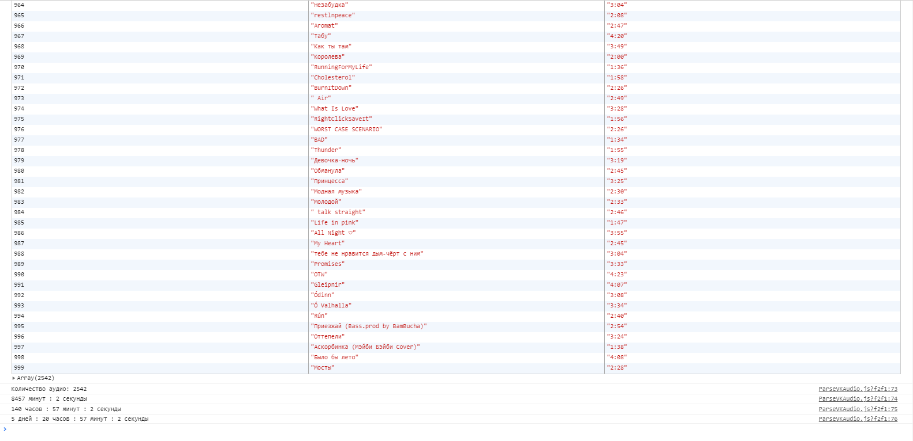
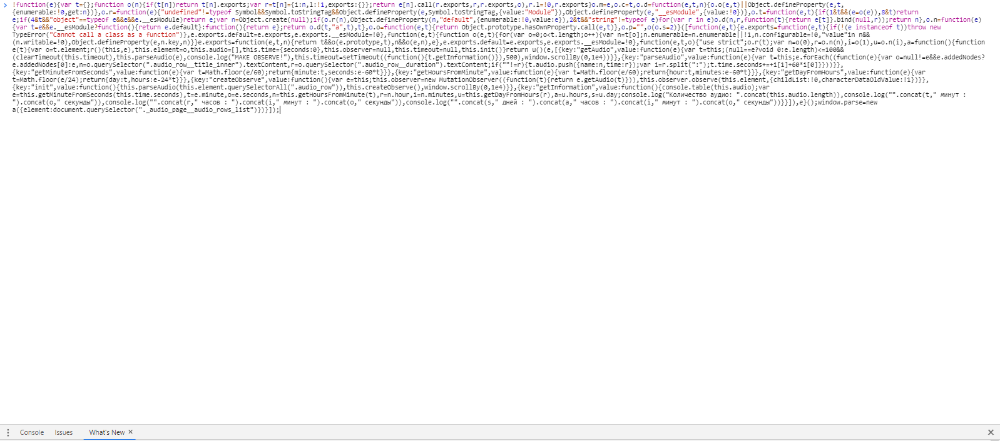
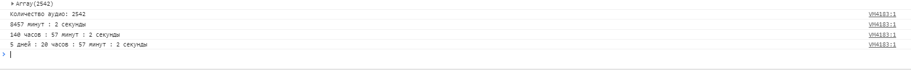

# VK-AUDIO-PARSE
Скрипт для получение всех аудио и получение общей продолжительности
После запуска и обработки все информации выводится в таком виде:
;

## Как запустить?
---
Чтобы запустить этот скрипт, нужно из папки **build** взять файл **app.js** и вставить его в консоль браузера

После этого нужно подождать, пока скрипт соберет всю инфу и выведет:

